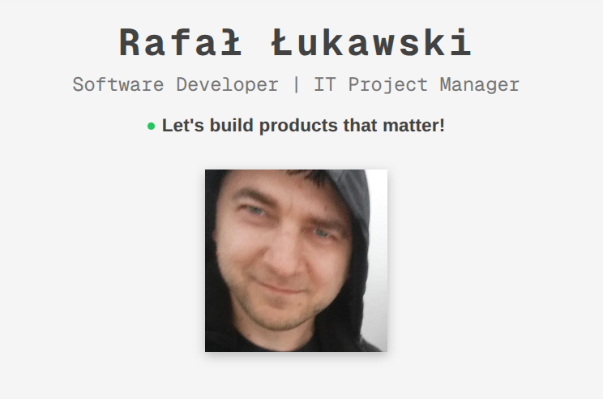

# 🌐 Personal Portfolio Website

A modern, responsive personal portfolio website built with **Next.js 16**, **React 19**, and **Material UI 7**. Features internationalization (EN/PL), smooth animations, and a clean developer-focused design.



## ✨ Features

- **🌍 Internationalization** — Full English and Polish language support with `next-intl`
- **🎨 Modern UI** — Clean, professional design using Material UI 7 with custom theming
- **📱 Fully Responsive** — Optimized for mobile, tablet, and desktop
- **⚡ Special Effects** — Scramble text animation on navigation hover
- **🧭 Scroll Spy Navigation** — Active section highlighting as you scroll
- **📊 Google Analytics** — Built-in analytics integration
- **🐳 Docker Ready** — Multi-stage Dockerfile for production deployment
- **🔍 SEO Optimized** — Sitemap, robots.txt, and meta tags included

## 🛠️ Tech Stack

| Category | Technologies |
|----------|-------------|
| **Framework** | Next.js 16, React 19 |
| **Language** | TypeScript |
| **Styling** | Material UI 7, Emotion |
| **i18n** | next-intl |
| **Icons** | MUI Icons, React Icons |
| **Deployment** | Docker, Docker Compose |

## 📂 Project Structure

```
src/
├── app/                  # Next.js App Router pages
│   └── [locale]/         # Internationalized routes
├── components/           # React components
│   ├── HeroSection       # Landing hero with photo
│   ├── AboutSection      # Professional bio
│   ├── TechnologiesSection # Skills grid
│   ├── ProjectsSection   # Portfolio showcase
│   ├── CertificatesSection # Certifications display
│   ├── ContactSection    # Contact form
│   └── ScrambleText      # Text scramble hover effect
├── config/               # Navigation & social links config
├── hooks/                # Custom hooks (useScrollSpy)
├── i18n/                 # Translation files (en.json, pl.json)
└── theme/                # MUI theme customization
```

## 🚀 Getting Started

### Prerequisites

- Node.js 20+
- npm or yarn

### Installation

```bash
# Clone the repository
git clone https://github.com/rlukawski/personal-website-2.git
cd personal-website-2

# Install dependencies
npm install

# Run development server
npm run dev
```

Open [http://localhost:3000](http://localhost:3000) to view the site.

### Production Build

```bash
npm run build
npm start
```

### Docker Deployment

```bash
docker-compose up -d
```

## 🌐 Live Demo

- 🇬🇧 English: [lukawski.eu/en](https://lukawski.eu/en)
- 🇵🇱 Polish: [lukawski.eu/pl](https://lukawski.eu/pl)

## 📝 License

MIT © Rafał Łukawski
